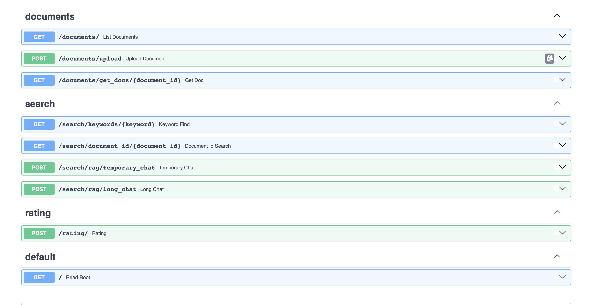
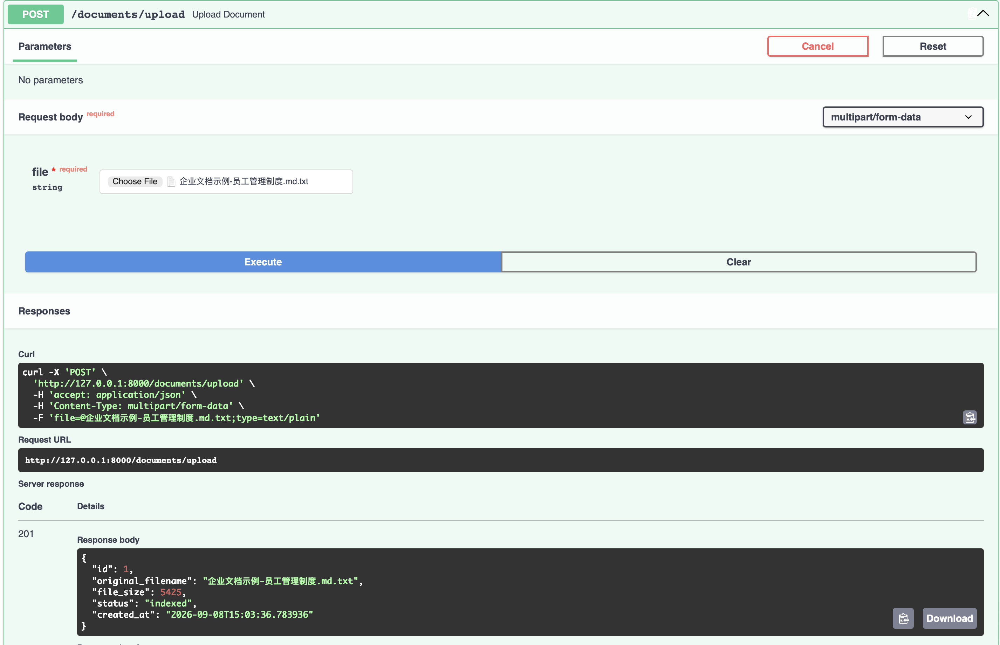
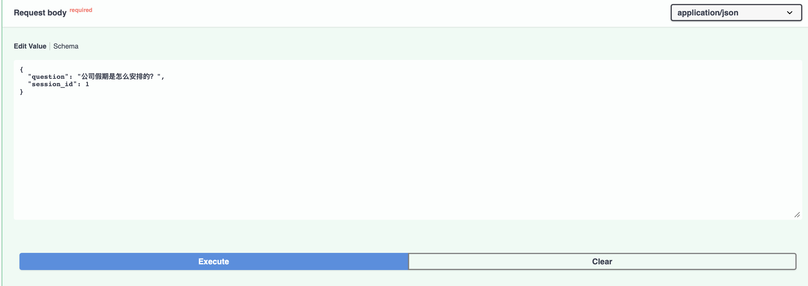
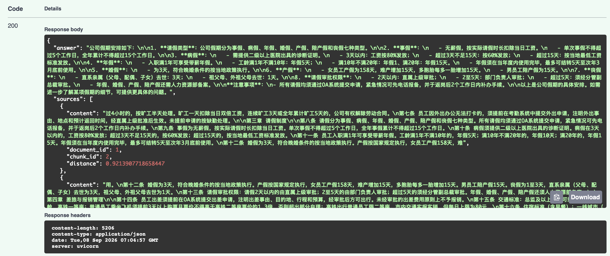
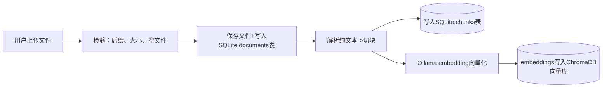
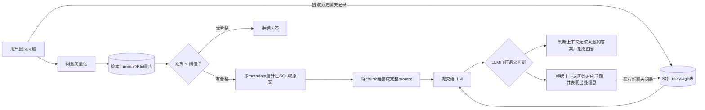
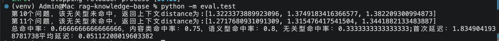

# 企业知识库RAG问答系统
基于本地大模型的企业文档问答系统，上传.md或.txt文件后即可针对内容进行提问，回答附带引用出处，支持多轮对话

## 效果演示





## 功能特性
- 文档上传与自动处理流水线（解析->切块->向量化引索
- 向量检索 + LLM生成，回答附带引用来源
- 距离阈值过滤 + prompt 双层拒答机制，拒绝回答知识库以外的知识
- 多轮对话（session管理）
- 回答评价反馈
- 内置评估系统

## 技术栈
- FastAPI 
- SQLite
- ChromaDB
- Ollama(qwen3-embedding:0.6b,qwen3:4b-instruct)

## 系统框架
上传流水线

问答链路


## 快速开始
**环境要求**：Python >= 3.10, 需要安装Ollama以及对应模型


```bash
# 1. 克隆项目
get clone https://github.com/YouMingKaMi/RAG-basic-system.git
cd rag-knowledge-base

# 2. 创建虚拟环境并安装依赖
python3 -m venv venv
source venv/bin/activate
pip install -r requirement.txt

# 3. 拉取本地模型（首次需要）
ollama pull qwen3-embedding:0.6b
ollama pull qwen3:4b-instruct

## 初始化SQLite数据库
python init_db.py
python init_llm_db.py
python init_feedback.py

# 4. 启动服务
uvicorn app.main:app --reload

```
启动后访问 http://127.0.0.1:8000/docs （Swagger 交互式文档），

## API 一览
| 方法 | 路径 | 说明 |
|---|---|---|
| POST | `/documents/upload` | 上传文档，自动完成解析、切块与向量索引 |
| GET | `/documents` | 文档列表 |
| GET | `/documents/{document_id}` | 单个文档详情 |
| GET | `/search/keywords/{keyword}` | 关键词检索 |
| GET | `/search/document_id/{document_id}` | 查看某文档的全部切块 |
| POST | `/search/rag/temporary_chat` | 一次性问答（无会话记录） |
| POST | `/search/rag/long_chat` | 会话内多轮问答（带上下文记忆） |
| POST | `/rating/` | 对回答评分（1 好评 / 0 差评，重复评分覆盖） |

## 评估结果


## 已知局限与演进方向
- 同步阻塞处理大文件（演进：后台任务 + 状态轮询）
- 对话历史无截断（演进：滑动窗口）
- 阈值检索的拒答上限（演进：rerank / 混合检索）
